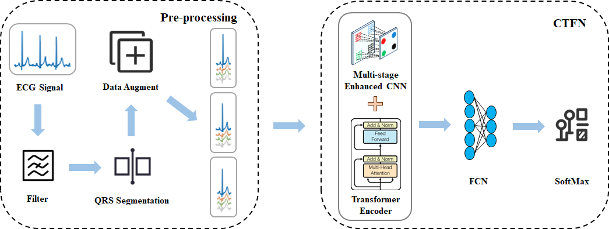

# CTFN: Multistage CNN-Transformer Fusion Network for ECG Authentication

This is a deployment documentation for the algorithm presented in my paper.

In the face of the mounting challenges posed by cybersecurity threats, there is an imperative for the development of robust identity authentication systems to safeguard sensitive user data.Conventional biometric authentication methods, such as fingerprinting and facial recognition, are vulnerable to spoofing attacks. In contrast, electrocardiogram (ECG) signals offer distinct advantages as dynamic, "liveness"-assured biomarkers, exhibiting individual specificity. This study proposes a novel fusion network model, the CNN-Transformer Fusion Network (CTFN), to achieve high-precision ECG-based identity authentication by synergizing local feature extraction and global signal correlation analysis. The proposed framework integrates a multi-stage enhanced convolutional neural network (CNN) to capture fine-grained local patterns in ECG morphology and a transformer encoder to model long-range dependencies in heartbeat sequences. An adaptive weighting mechanism dynamically optimizes the contributions of both modules during feature fusion. 



The code for this project has been uploaded to GitHub: <https://github.com/heng895/CTFN>. Interested researchers can download it themselves. Below are the deployment steps for the project.

# Procedure:

1. Getting the project:

   ```
   git clone https://github.com/heng895/CTFN.git
   ```

2. download databases

   ECGID: https://physionet.org/content/ecgiddb/1.0.0/

   MIT-ARR: https://physionet.org/content/mitdb/1.0.0/

   MIT-NSR: https://physionet.org/content/nsrdb/1.0.0/

   CYBHi: https://zenodo.org/records/2381823#.XT2Ik9VKG2w

   

3. Install virtualenv

   ```shell   
   # Mac OS
   $ sudo -H pip install virtualenv
         
   # Windows
   $ pip install virtualenv
   ```

4. Create a virtual environment

   ```shell
   # Mac OS
   $ virtualenv -p python3 venv
   # Windows
   $ python3 -mvenv venv
   ```

5. Activate the environment

   ```shell
   # Mac OS
   $ source venv/bin/activate
   # Windows
   $ venv\Scripts\activate
   ```

6. Install the requirements.txt

   ```shell
   # Mac OS
   $ pip3 install -r requirements.txt
   # Windows
   $ python3 -m pip install -r requirements.txt
   ```

7. Once the data is fully set up, run the following commands to extract signals into readable **csv** file formats

   ```shell
   $ python3 run.py -s-mit
   $ python3 run.py -s-ecgid
   ```

8. For Feature Extraction, run. 

   ```
   $ python3 run.py -f-mit
   $ python3 run.py -f-ecgid
   ```

9. Set up data for Training

   ```
   $ python3 run.py -setup
   ```

10. Train the CTFN model. 

    ```
    $ python3 run.py -CTFN
    ```

